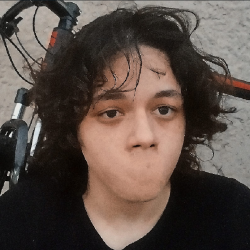

<!DOCTYPE html>
<html lang="pt-br">
  <head>
    <meta charset="UTF-8" />
    <meta name="viewport" content="width=device-width, initial-scale=1.0" />
    <link rel="shortcut icon" href="favicon.ico" type="image/x-icon" />
    <link rel="preconnect" href="https://fonts.googleapis.com">
  </head>
  <body>
    
    <h1>Gabriel Henn</h1>
    <h2>Quem sou eu?</h2>
    

      Meu nome é Gabriel Henrique Modesto, ou Gabriel Henn, atualmente estou
      cursando a Terceira Série do Ensino Médio.
    

    <h2>Por que estou aqui?</h2>
    

      Estou aqui para aprender mais sobre programação e desenvolvimento de
      sites, pois é uma área que me interessa muito e que eu pretendo seguir
      carreira. Iniciando em HTML e CSS com os vídeos do canal Curso em Vídeo,
      do professor Gustavo Guanabara.
    

      
  </body>
</html>
